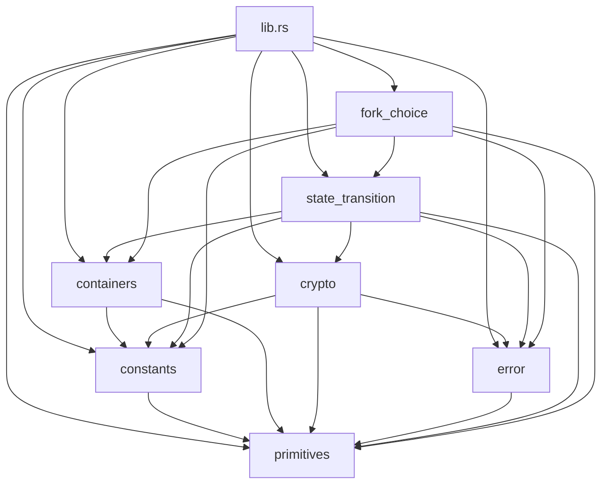

# Moonglass

[![Build][actions-badge]][actions-url]

[actions-badge]: https://github.com/brech1/moonglass/actions/workflows/build.yml/badge.svg
[actions-url]: https://github.com/brech1/moonglass/actions?query=branch%3Amaster

> [!WARNING]
> Moonglass is experimental.

Moonglass is an experimental Rust companion implementation for reading Ethereum consensus behavior, currently focused on the GLOAS-era consensus-specs surface.

The name comes from a stone that reveals the essence of things under moonlight. Moonglass is built with the same intent, hold Ethereum consensus up to the light until its actions become easier to see.

Moonglass mirrors covered consensus-specs behavior with a focus on readability, not performance.

This repository is experimental and is not production-ready.

## How to Read It

Start with `BeaconState`. It is the object every transition moves forward. From there, follow `moonglass/src/state_transition/` to see how a proposed change is checked and how an accepted change becomes the next state.

The containers in `moonglass/src/containers/` describe the data that consensus signs, hashes, stores, and moves through the transition. The primitives and constants give that data protocol meaning. The errors explain why a transition cannot be accepted.

`moonglass/src/fork_choice/` reads accepted blocks and attestations and decides which leaf the next block should build on. It calls into `state_transition` to advance cached states, it does not duplicate transition rules. Function and field names mirror the consensus-specs fork-choice documents so the two can be read side by side.

The generated Rust docs are intended to be read as a short guide next to the code:

```bash
cargo doc --no-deps --open
```

## Module Map



## Branches

The `master` branch should track the current `mainnet` enabled behavior. For now, as an exception, `gloas` will be the current master.

A `heze` branch can be used to track future updates, to be merged into master when it goes live.

## Tests

The `consensus-specs` reference tests suite can be run with:

```bash
cargo build --release -p reftests
target/release/reftests
```

The reference-test runner targets the hardcoded consensus-specs release and fork documented in `reftests/src/main.rs`. Unsupported fixture families are skipped by discovery, so a passing run means the currently wired fixtures passed, not that the whole upstream suite is covered.

## Possible Next Steps

- Execution-engine validity: payload verifier feeding `Store::payloads`
- KZG blob wrappers on top of `moonglass/src/crypto/kzg/`
- Networking and sync support
- In-house SSZ (currently `ssz_rs`)
- BLS `aggregate_verify` (unblocks `bls/aggregate_verify` fixtures)
- Reference-test adapters: `kzg`, `merkle_proof`, `shuffling`, `genesis`
- Wall-clock fork-choice driver
- Rust to Lean4 generator and formal verification
- Documentation and readability
- CI (nightly reftests)
