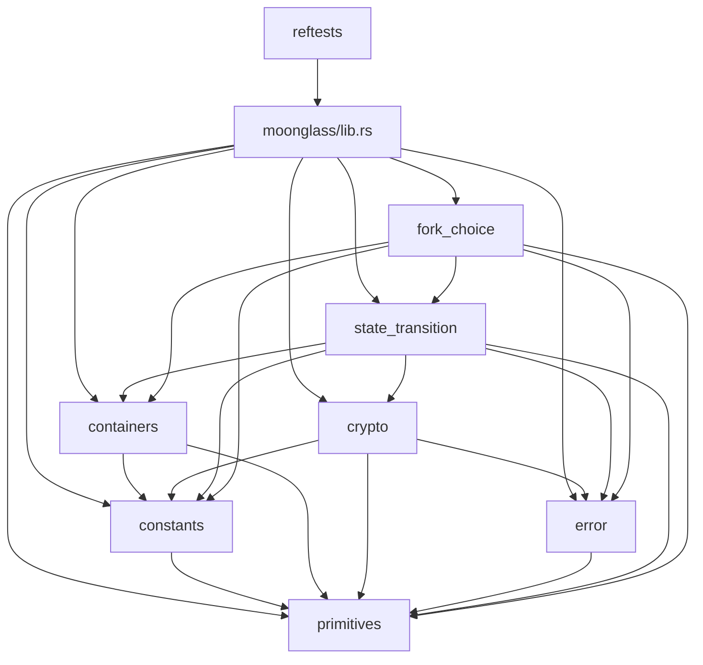

# Moonglass

[![test][test-badge]][actions-url] [![coverage][coverage-badge]][coverage-url] [![docs][docs-badge]][docs-url] [![license][license-badge]][license-url]

[test-badge]: https://github.com/brech1/moonglass/actions/workflows/test.yml/badge.svg
[actions-url]: https://github.com/brech1/moonglass/actions?query=branch%3Amaster
[coverage-badge]: https://codecov.io/gh/brech1/moonglass/branch/master/graph/badge.svg
[coverage-url]: https://codecov.io/gh/brech1/moonglass
[docs-badge]: https://img.shields.io/badge/docs-online-blue
[docs-url]: https://brech1.github.io/moonglass/
[license-badge]: https://img.shields.io/badge/license-AGPL--3.0-blue
[license-url]: https://github.com/brech1/moonglass/blob/master/LICENSE

> [!WARNING]
> Moonglass is experimental.

Moonglass is a Rust implementation of selected Ethereum
consensus paths. It is built for traceable reading: each path should make clear
which object enters, which rule owns it, what state changes, and which
[consensus-specs] reference fixture backs the behavior.

The name comes from a stone that reveals the essence of things under moonlight.
The metaphor is practical: the code should expose protocol behavior without
mixing the consensus path with production-client concerns.

## Scope

Moonglass focuses on:

- State-transition and fork-choice behavior.
- Typed consensus objects, constants, and errors that stay close to the spec
  shape.
- Rustdoc as the primary explanation layer.
- Reference-test evidence from implemented `ethereum/consensus-specs` adapters.

## Evidence

- `mainnet` is the default Cargo feature for local crate usage.
- PR-required lint, unit-test, and Rustdoc CI use the default `mainnet` preset.
- PR-required consensus reftests use the faster `minimal` preset.
- Post-merge CI and coverage also run mainnet consensus reftests.
- Passing fixtures mean the currently wired adapters passed, not that every
  upstream fixture family is covered.
- The `moonglass` crate has no inline unit tests today. Consensus behavior is
  checked through `reftests`.

## Reading Model

Start with the state boundary, not the directory tree. `BeaconState` is durable
consensus state, advanced by state transition. `Store` is one node's local
fork-choice view, updated after accepted blocks and messages. `Store::payloads`
is local payload evidence, not an execution-engine verdict. `ForkChoiceNode`
includes payload status because head selection may choose between pending,
empty, and full payload branches.

For any consensus path, ask:

1. What object enters the path?
2. Which rule owns it: state transition, fork choice, or the fixture adapter?
3. What is read and what is mutated: `BeaconState`, `Store`, both, or neither?
4. What is verified locally, and what external verifier is not modeled?
5. Which `reftests/src/adapters/` fixture family is evidence for it?

Useful entry points:

- Blocks: `BeaconState::apply_signed_block`, then `fork_choice::on_block`.
- Payload commitments: `process_execution_payload_bid`,
  `fork_choice::on_execution_payload_envelope`, and
  `accept_parent_payload_commitment`.
- Votes and head choice: `process_attestation`, `fork_choice::on_attestation`,
  and `fork_choice::get_head`.
- Fixture scope: `reftests/src/adapters/`.

## Dependency Map

## Repository Layout

| Path | Role |
| --- | --- |
| `moonglass/src/containers/` | SSZ containers carried by consensus paths. |
| `moonglass/src/primitives/` | Typed roots, slots, epochs, indices, and checked arithmetic. |
| `moonglass/src/constants/` | Consumed protocol constants for the active preset. |
| `moonglass/src/state_transition/` | Slot, epoch, block, operation, and builder processing. |
| `moonglass/src/fork_choice/` | Local store updates, filtering, weights, and head selection. |
| `moonglass/src/crypto/` | Hashing, BLS, and KZG wrappers. |
| `moonglass/src/error/` | Centralized rejection reasons. |
| `reftests/` | Consensus-specs fixture runner and adapters. |

## Documentation Standard

Rustdoc is the project documentation surface. Published docs are available at
[brech1.github.io/moonglass](https://brech1.github.io/moonglass/).

Library docs should explain protocol ownership, mutations, invariants, and
boundaries where the code makes those decisions.

The workspace denies missing docs, unused code, dead code, unreachable public
items, unsafe code, broken intra-doc links, and Clippy `all` and `pedantic`.
The `missing_errors_doc` lint is allowed because error descriptions are
centralized in the error modules. The `reftests` crate mirrors the policy but
does not require private item docs for test plumbing.

See [CONTRIBUTING.md](CONTRIBUTING.md) for review, testing, and documentation
policy.

## Pending Work

These are useful implementation areas for contributors who want to extend the
project while preserving its emphasis on readable consensus behavior:

- Wire execution-engine payload validity into the payload evidence path.
- Add blob and data-availability verification.
- Implement networking, sync, and wall-clock fork-choice driving.
- Add missing reference-test adapters for uncovered fixture families.
- Replace the current `ssz_rs` dependency with in-house SSZ when the project is
  ready to own that surface.
- Explore Rust-to-Lean generation and formal verification.

## License

Moonglass is licensed under [AGPL-3.0-only](LICENSE).

[consensus-specs]: https://github.com/ethereum/consensus-specs
